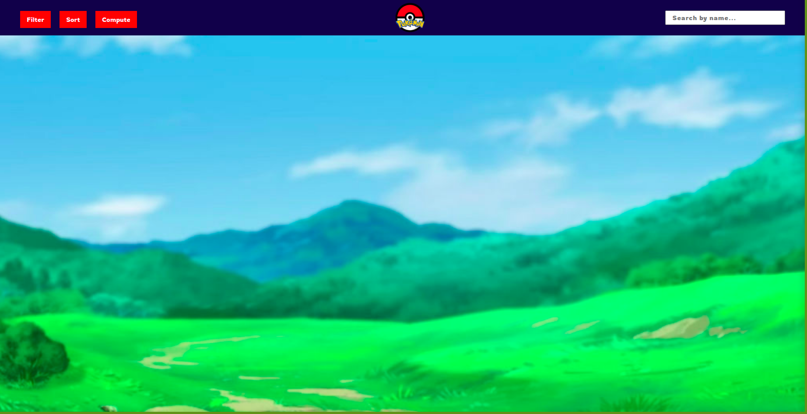
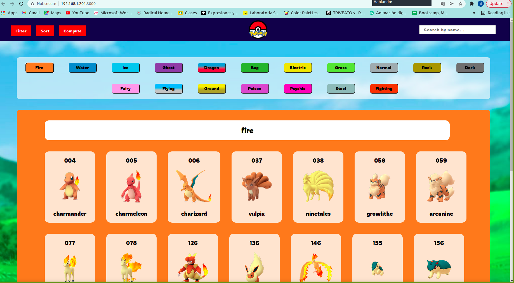
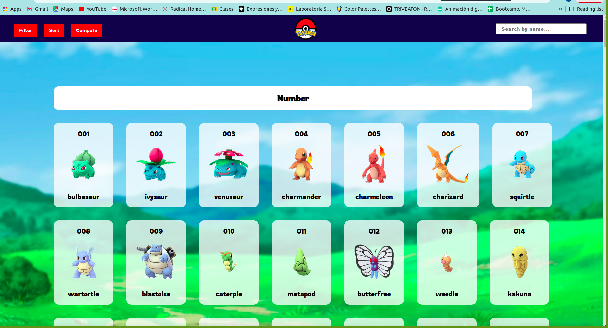
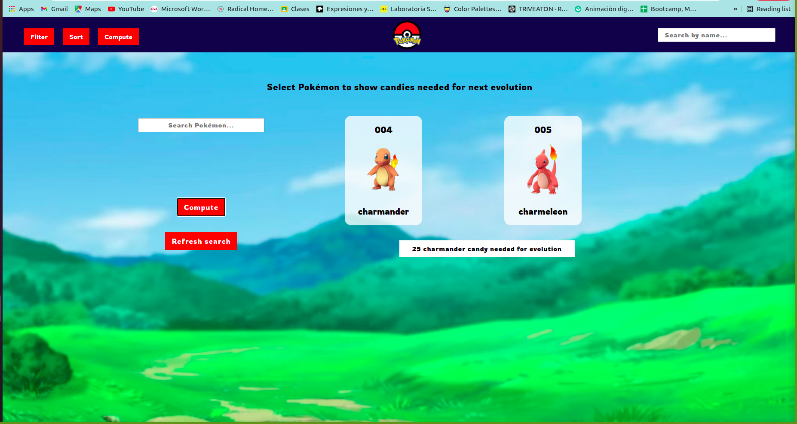
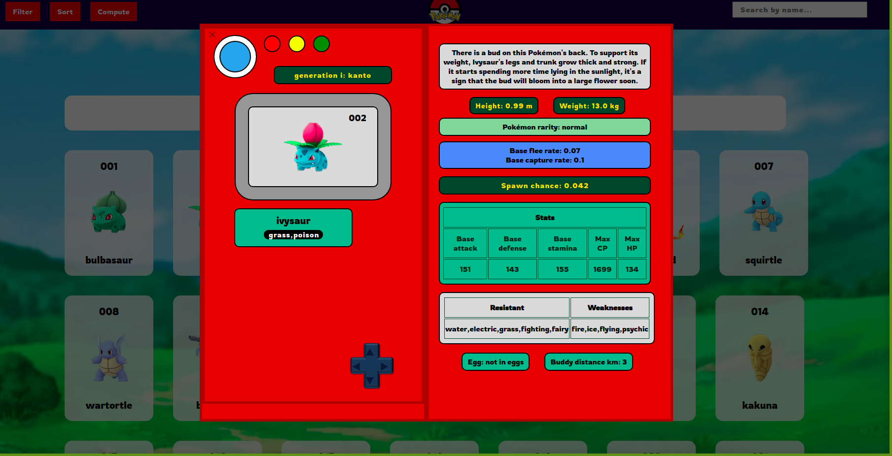
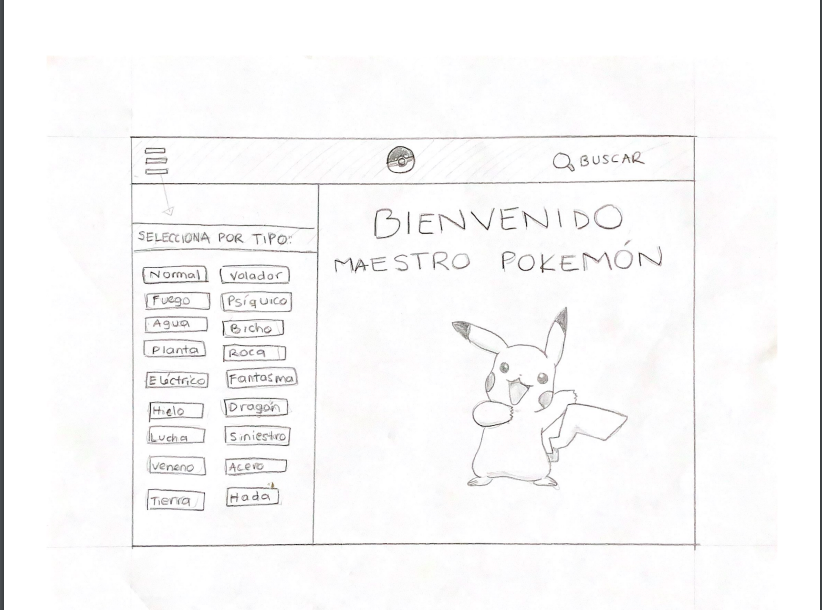
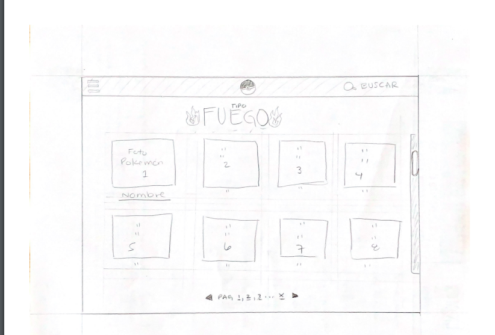
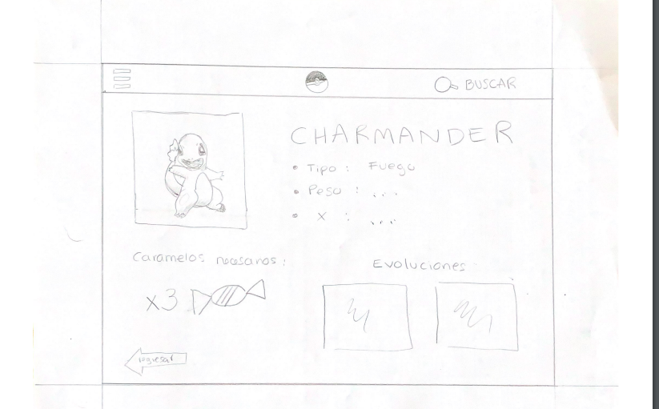
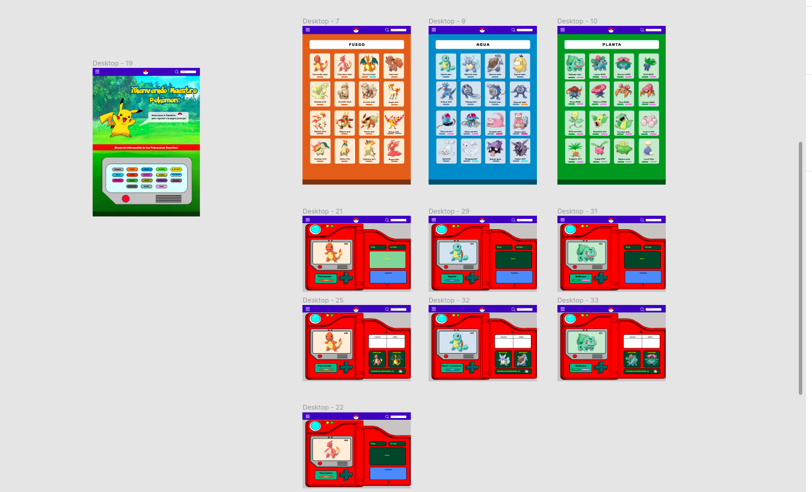

## 1. Resumen del proyecto

En este proyecto construimos una página web para visualizar 
data de pokemones que se adecúa a las necesidades del usuario.

Como entregable final tenemos una página web que permite visualizar la data,
filtrarla, ordenarla y hacer algún cálculo agregado.

## 2. Investigación UX

La base de este proyecto fue centralizada en las necesidades de nuestros usuarios.En diseño, funcionaliadad y experiencia.
Los usuarios de este proyecto son jugadores de pokemon go, que tienen distintas necesidades, las cuales representan los problemas fundamentales que nuestro proyecto resuelve:
1.Buscan visualizar los pokemones por medio de un orden específico que ellos escojan.
2.Buscan visualizar los pokemones dependiendo del tipo, debilidad o resistencia.
3.Buscan acceder a información detallada del pokemon que elijan.
4.Buscan saber cuantos caramelos necesitan para que su pokemon evolucione y cuál sería esa evolución.

## 3. Comentarios básicos

Confome empezamos armar la página algunos de los comentarios que recibimos fueron que podríamos aprovechar el espacio al máximo para que el usuario to estuviera bajando en la página hasta encontrar lo que necesitaba.
Otro fue la organización de los elementos (botones, buscador etc)
Intentamos siempre basarnos en el prototipo de alta fidelidad, ya que los usuarios pidieron ese diseño(caja modal, colores, etc).

### 4.Boceto a lápiz

## 5. Prototipo en Figma

