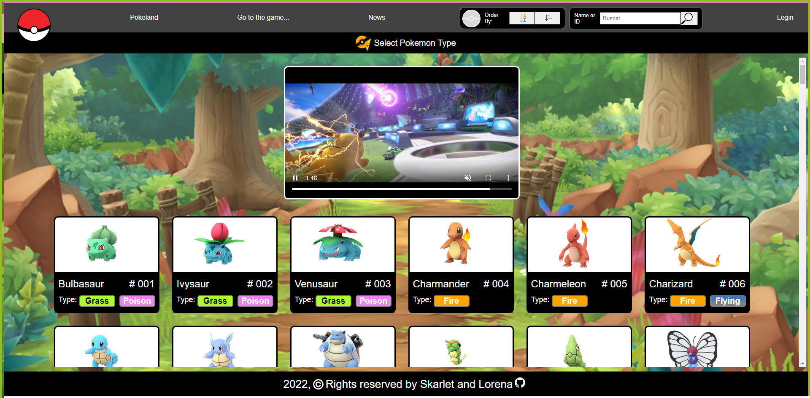
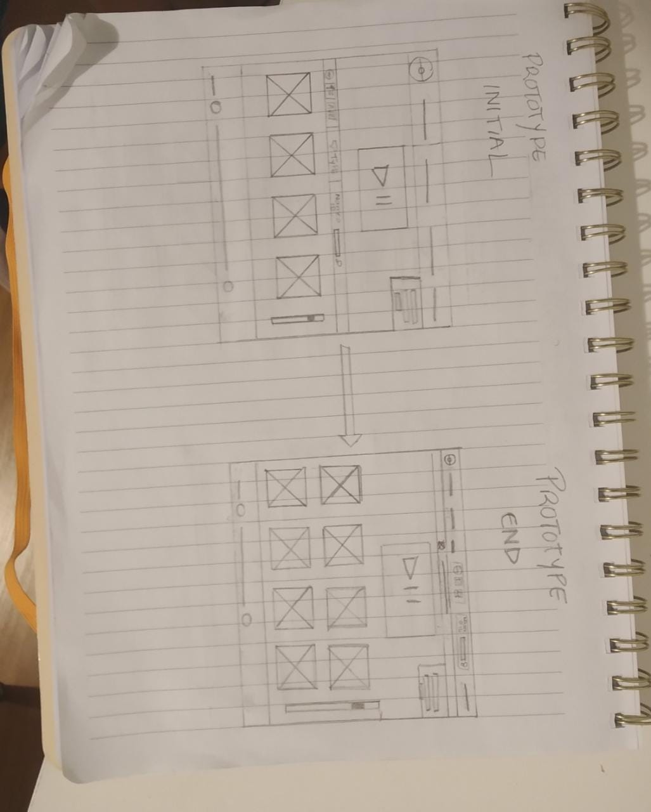
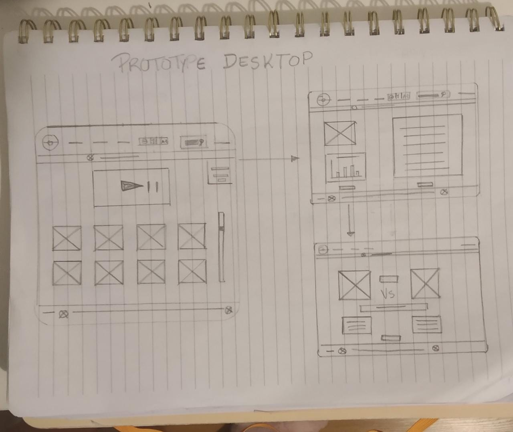
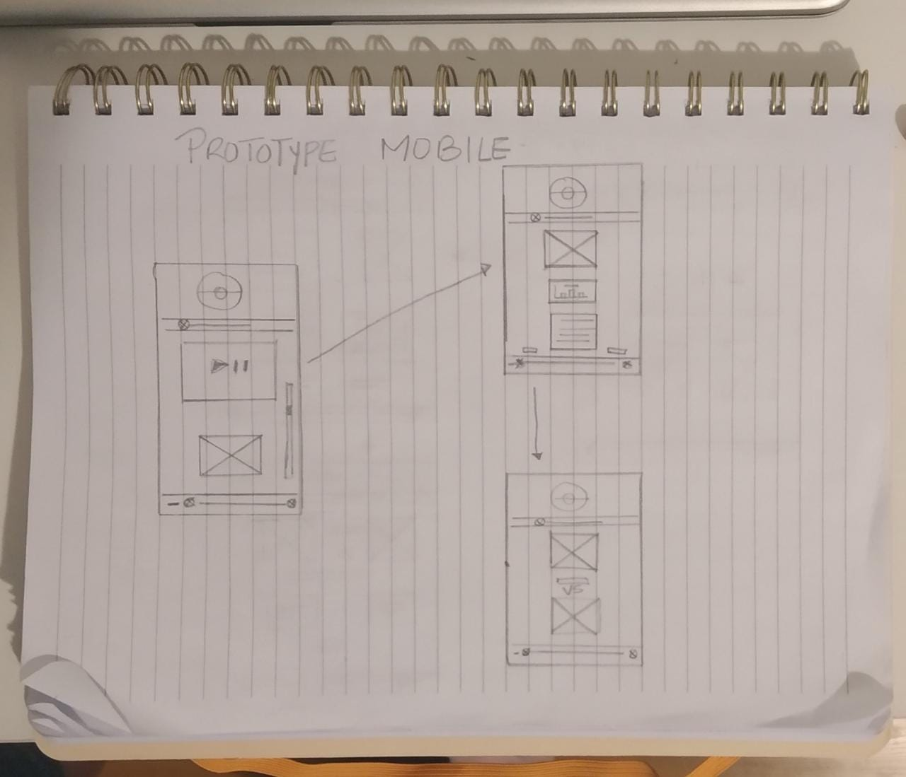
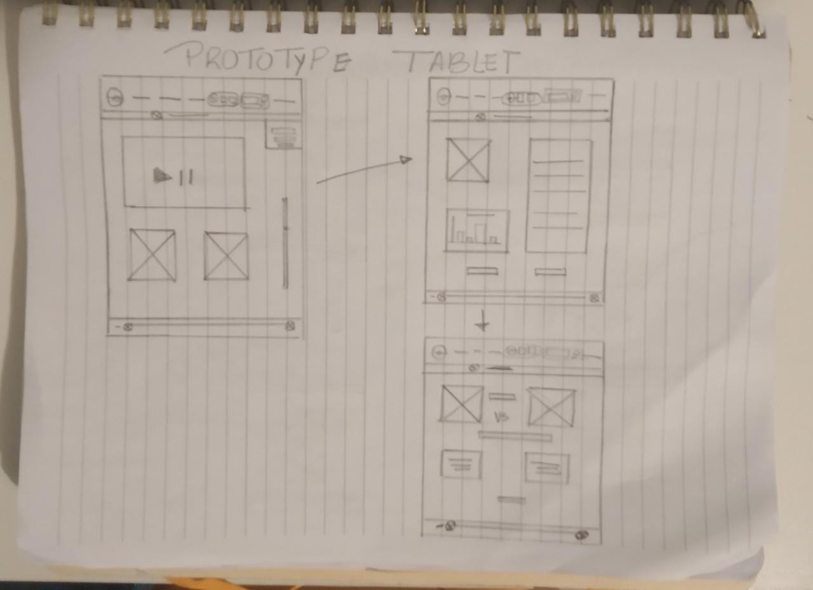
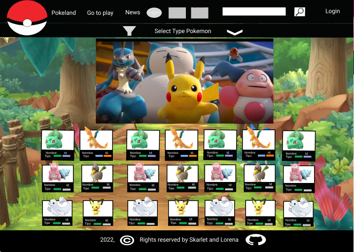

# DATA LOVERS POKELAND

## Índice

* [1. Resumen del proyecto](#1-resumen-del-protecto)
* [2. Investigación UX](#2-inventigación-UX)
* [3. Contruido con](#3-construido-con)
* [4. Autores](#4-autores)
* [5. Licencia](#5-licencia)

***

## 1. Resumen del proyecto

En este READ.ME encontrarás la información general aceca de la elaboración de una página web que sirve para mostrar en tarjetas los 251 Pokemones e interaccionar con su información através de botones de ordenar, filtrar y calcular.

## 1.1 Imagenes del proyecto

##  - Imagen del proyecto final

## - Imagen de información de Pokemon

.png)

## - Imagen de escoger un Pokemon Random para la batalla

.png)

## - Imagen del mensaje del ganador de la batalla

.png)

## - Imagen de información no encontrada

.png)

***

## 2. Investigación UX

### 2.1 Definición del producto

El proyecto fue elaborado con la finalidad de entender la necesidades del usuario y acorde a sus peticiones se crearon historias de usuario que sirvieron como pasos para tener una interfaz amigable y mostrar una data de Pokemon.

### 2.2 Solución a los usuarios

Las historias de usuario en las que se basa el proyecto para darle solución al problema, son las siguientes:

- HU-1:Yo como usuario de Pokemon quiero vizualizar todos los pokemones a traves de tarjetas para tener una nocion de todos ellos.
- HU-2: Yo como usuario de pokemon quiero visualizar por orden alfabetico, ascendente y descendente a los pokemon para tener orden en mi busquedad
- HU-3: Yo como usuario de pokemon quiero Filtrar por tipos todos los pokemon de la data para conocer algunas caracteristica especificas
- HU-4 Yo como usuario de pokemon quiero Filtrar a traves de un boton de buscador por id y nombre los pokemones de la data para solo traer una caracteristica en especifica
- HU-5 Yo como usuario de pokemon quiero visualizar en una pantalla cada uno de los pokemon para conocer a detalle sus caracteristicas.
- HU-6 Yo como usuario de Pokemos quiero visualizar a traves de un boton de calcular cual pokemon gana para saber cual es el mejor

### 2.3 Elaboración de prototipo de baja fidelidad

### 2.4 Feedback

Al presentar el proyecto con los usuarios nos porporcionaron las siguientes recomendaciones:

- Utilizar colores más nitidos cuando se trabaje con un fondo que puede opacar la información.
- Unificar la barra de navegación en donde se muestran los botones que te llevan a otra página, ordenar alfabeticamente, ordenar numéricamente  y el buscador.
- Mostrar un mensaje indicando que no existe una infoamción en la data.
- Através de un botón comparar en una batalla dos Pokemones.

### 2.5 Prototipo Final

***

## 3. Construido con 🛠️

Las herramientas que utilizamos para la elaboración de este proyecto son las siguientes:

* [HTML] - Lenguaje de Marcado de Hipertexto
* [CSS] - Hojas de Estilo en Cascada
* [JAVASCRIPT] -  lenguaje de programación interpretado
* [FIGMA] - Elaboración del prototipo  (https://www.figma.com/file/bBcDX52Z8IB1zBSzmJxxR8/PokemonLand?node-id=96%3A2)
* [TRELLO] - Planeación de actividades (https://trello.com/b/sHwPD8SI/data-lovers)

***

## 4. Autores ✒️

Las personas que contribuyeron en la elaboración de este proyecto son las siguientes:

* **Skarlet Araque** - *Proyecto completo*
* **Lorena Rojas** - *Proyecto completo*

***

## 5. Licencia 📄

Este proyecto está bajo la Licencia by Skarlet Araque and Lorena Rojas (Data_Lovers_Polkeland).

---
⌨️ con ❤️ por [Skarlet Araque y Lorena Rojas] 😊